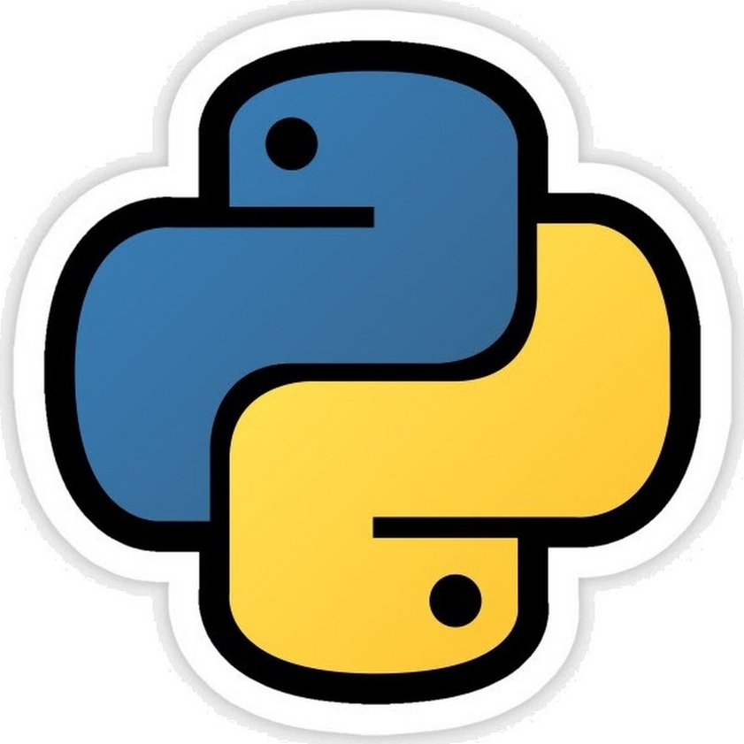

<!DOCTYPE html>
<html lang="en">
<head>
    <meta charset="UTF-8">
    <title>Hobby</title>
    <link rel="stylesheet" href="hf.css">
</head>
<body>

<nav class="header">
    

        

            <h1>My Hobby</h1>
        

        <ul class="navigation">
            <a href="#" title ="Main page"><li>Main page</li></a>
            <a href="#" title ="Some info about myself"><li>About myself</li></a>
            <a href="https://t.me/Viton4ik" title ="@Victor"><li>Contact</li></a>
        </ul>
    

</nav>

<!-- Main Content-->

    

        

        

        

        

        <h1>Codding</h1>
        

        

        

        

    

    

        

            

            
            <h1><em>Hello there!</em></h1>
            <h2>I'm Victor.</h2>
            <h3>I have been started learning programming languages half a year ago.
                Learning Python, Django, JavaScript, and CSS I am trying to convert myself into a full-stack developer.
                Unfortunately, I'm not so skilled at the moment, but I'm doing my best and looking forward to getting this goal.
                So, the goals have been set, waiting for the result! See you!
            </h3>
        

    

<footer class="footer">
    

        
    

</footer>
</body>
</html>
Footer
© 2023 GitHub, Inc.
Footer navigation
Terms
Privacy
Security
Status
Docs
Contact GitHub
Pricing
API
Training
Blog
About

